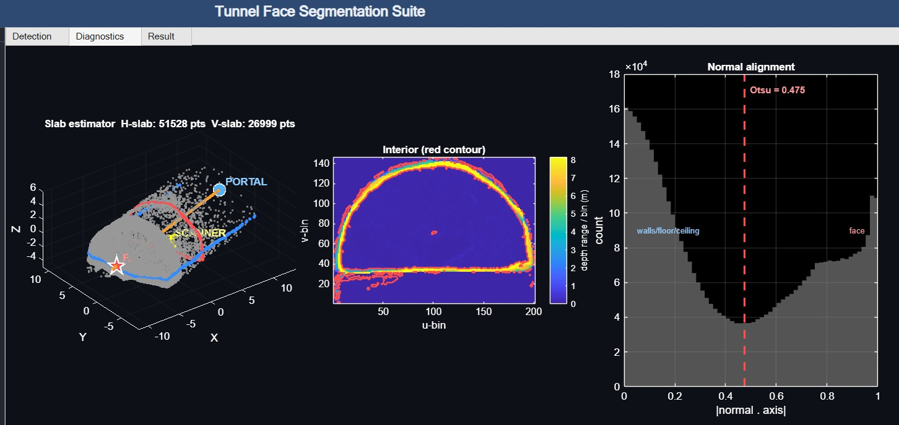
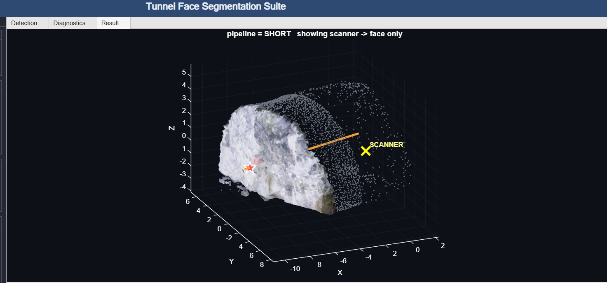
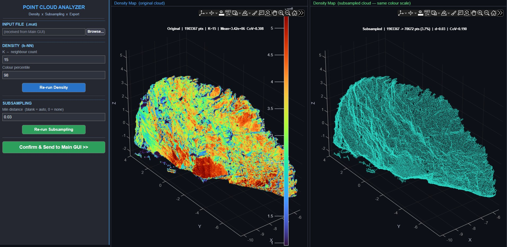
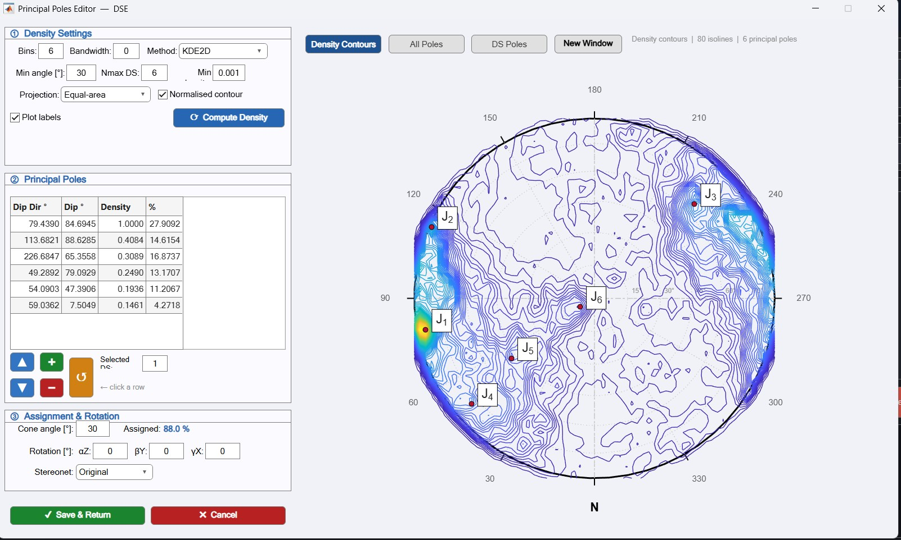
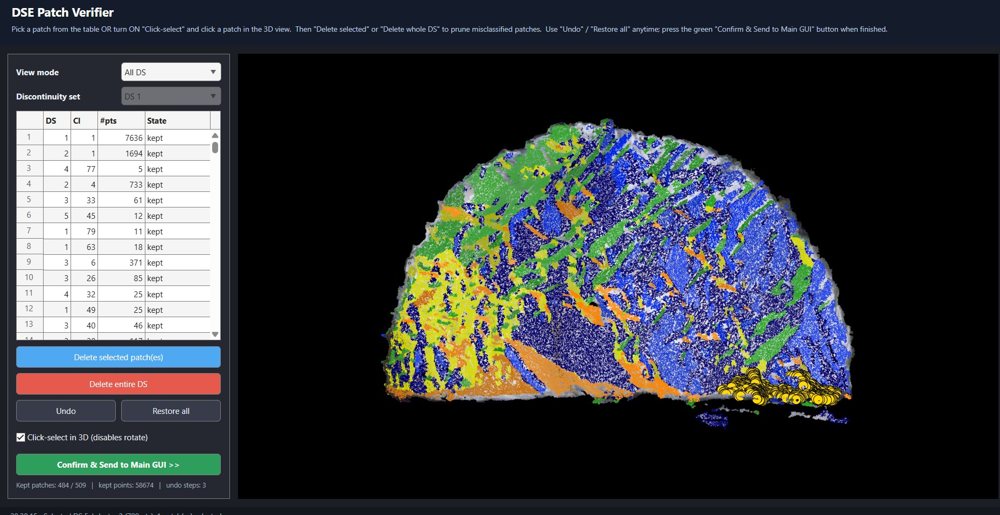
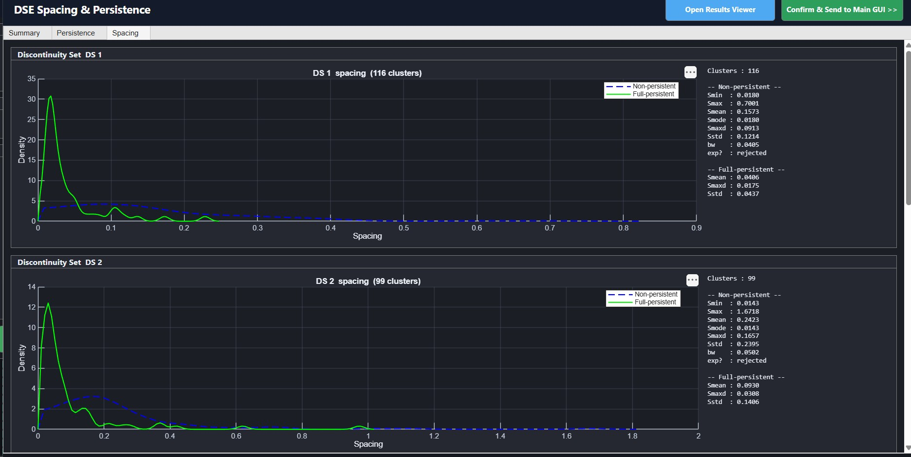
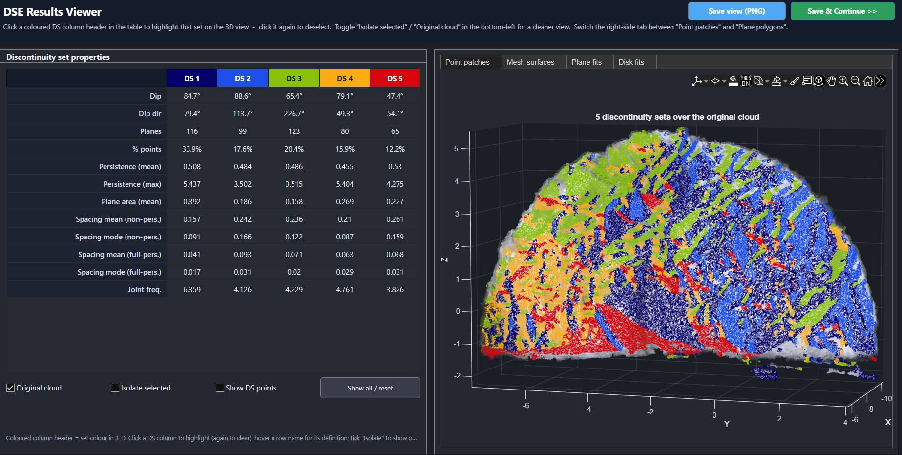
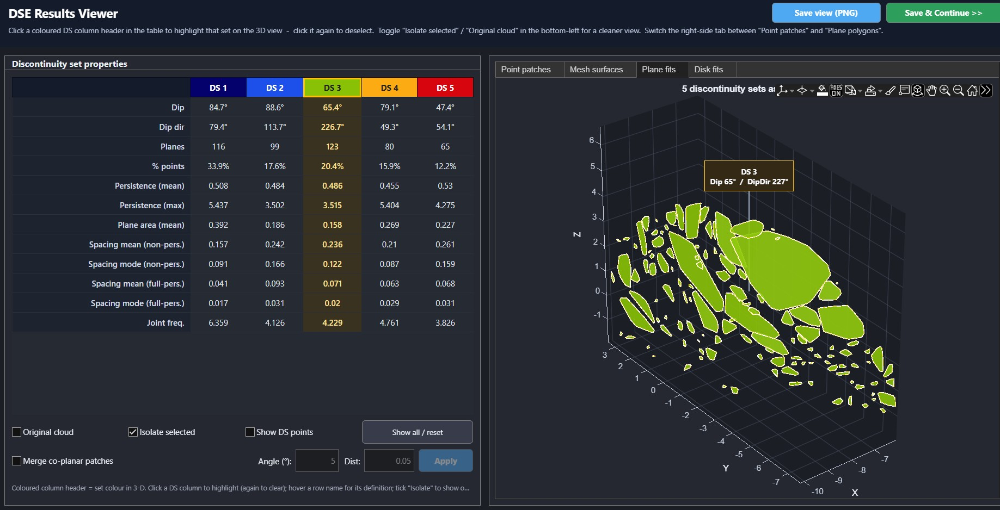

# Digital Tunnel Face Mapper

**Automated discontinuity mapping of tunnel faces from 3-D point clouds and photographs.**

A nine-stage MATLAB pipeline that takes a raw laser scan of an excavated tunnel
face and returns per-set orientation, persistence, spacing and joint frequency —
the geometric inputs of rock mass classification — together with 3-D joint
patches and 2-D traces registered to the face photograph.

[](https://youtu.be/AmI14mFLLYw)


**Installer:** https://github.com/ahmadmehri/Digital-Tunnel-Face-Mapper/releases/tag/Digital_Face_Mapping

**Sample Data:** https://github.com/ahmadmehri/Digital-Tunnel-Face-Mapper/releases/tag/Tunnel_Face


*The same discontinuities twice over: 3-D patches on the photo-recoloured point
cloud (left), and their 2-D traces on the tunnel face photograph (right).*

---

## Why

Face mapping happens under time pressure, in poor light, with limited access to
the face and a cycle waiting on the result. Hand-drawn sketches and manual joint
logs vary between geologists and are difficult to audit once the face is
shotcreted and gone.

Working from the scan makes the measurement reproducible, keeps the original
data available for re-analysis, and produces per-set statistics rather than a
single subjective estimate.

---

## Pipeline

Nine stages. Data is passed between stages **in memory** — no intermediate files
are written. In *Automatic* mode the pipeline runs end to end and pauses only at
stage 4, the mandatory user checkpoint.

| # | Stage | What it does |
|---|-------|--------------|
| 1 | **Segment Tunnel Face** | Isolates the rock face from walls, floor and instruments |
| 2 | **Uniform Downsampling** | Cell-grid subsampling (default 3 cm) to remove scan-density bias |
| 3 | **DSE — Set Extraction** | Per-point normals, Schmidt pole-density stereonet, principal sets, DBSCAN patch clustering |
| 4 | **Patch Verifier** | Manual checkpoint: keep or delete every detected joint patch |
| 5 | **Spacing & Persistence** | Per-set trace length, plane area, perpendicular spacing, KDE distributions |
| 6 | **Results Viewer** | 3-D overview of every set as points / mesh / polygon / disk |
| 7 | **Photo → Point Cloud Alignment** | Registers the face photograph to the cloud (SIFT/KAZE/ORB + PnP) and recolours it |
| 8 | **2-D Trace Mapper** | Projects each verified patch into the face image and draws its 2-D trace |
| 9 | **DFM Viewer** | Side-by-side 3-D patches vs 2-D traces, with synced selection and per-set statistics |

---

## Walkthrough

### 1 — Segment the tunnel face

The tunnel axis is estimated by partitioning points on surface-normal
orientation. An Otsu threshold on the normal-alignment histogram separates the
face from walls and floor, and an interior depth-range contour confirms the
cross-section was fitted correctly.



Only the rock face survives the cut. Per-point RGB is preserved for downstream
visualization.



### 2 — Remove scan-density bias

Scanners sample near-normal, near-range surfaces far more densely than oblique
or distant ones. Left uncorrected, that bias propagates straight into the
pole-density stereonet. A uniform cell grid fixes it before set extraction runs.



*In the example above: 1.9 M points → 70.7 k at d = 0.03 m, with the coefficient
of variation of local density falling from 0.308 to 0.190.*

### 3 — Extract discontinuity sets

Per-point normals are projected onto an equal-area Schmidt stereonet and
contoured by 2-D kernel density. Principal poles are picked at the density
peaks; each becomes one discontinuity set. A cone angle governs how points are
assigned to a set, and DBSCAN then clusters the assigned points into individual
joint patches.



*Six principal poles (J1–J6) on the density contours. Set count, bandwidth,
cone angle and stereonet rotation are all adjustable.*

### 4 — Verify the patches

The one stage that is deliberately not automatic. Every DBSCAN cluster is drawn
on the RGB face, coloured by its set, and kept or deleted by the operator —
selected from the table or clicked directly in 3-D. Whole sets can be dropped at
once, and every action is undoable.



Automated set extraction will always produce some misclassified patches. Rather
than hide that behind a threshold, the pipeline stops and asks.

### 5 — Persistence and spacing

Per-set distributions of perpendicular spacing, as kernel density estimates
under both a non-persistent (nearest-neighbour) and a full-persistent
(infinite-plane) assumption. Persistence is reported as maximum trace length and
plane area with an exponential fit.



Joint frequency follows as the reciprocal of mean spacing per set.

### 6 — Review in 3-D

Four representations of the same clusters, switchable by tab:

- **Point patches** — the raw classified points
- **Mesh surfaces** — draped Delaunay mesh over the measured points, so curved and twisted patches keep their real shape
- **Plane fits** — strictly planar convex-hull polygons on each cluster's local-PCA plane
- **Disk fits** — the familiar single-disk-per-joint abstraction



*Point patches tab, with per-set dip, dip direction, persistence, spacing and
joint frequency in the properties table.*



Co-planar patches can optionally be merged into larger polygons using an angle
and distance tolerance.

---

## Requirements

**MATLAB R2022b or newer**, with:

- Computer Vision Toolbox
- Image Processing Toolbox
- Statistics and Machine Learning Toolbox

Developed and verified on R2026a and R2024b.

To check your installation:

```matlab
need = {'Computer Vision Toolbox'
        'Image Processing Toolbox'
        'Statistics and Machine Learning Toolbox'};
have = {ver().Name};
for i = 1:numel(need)
    fprintf('  [%s]  %s\n', string(any(strcmpi(have, need{i}))), need{i});
end
```

---

## Running from source

Open MATLAB at the repository root — the folder containing
`FaceMapping_MainGUI.m` — and run:

```matlab
FaceMapping_MainGUI
```

Starting from the root matters: the orchestrator adds the module folders to the
path itself.

---

## Standalone application

A compiled Windows build requires no MATLAB licence, only the **MATLAB Runtime
R2024b** (free from MathWorks).

To build it yourself, run `deploymentScript.m` from a fresh MATLAB session.
Two things in that script are load-bearing and documented in its header:

- **It must be run on R2024b.** Compiled with R2026a on our machine, deployed
  `uifigure` windows never appear — the embedded Chromium renderer that MATLAB
  uses for App Designer graphics is never launched, and the app starts with no
  window. R2024b is unaffected.
- **No `startup.m` may be on the path.** The Runtime executes `matlabrc` →
  `startup` at application launch, so any `startup.m` visible at build time is
  packaged and run on the end user's machine. The script refuses to build if it
  finds one.

---

## Citation

If you use this software in published work, please cite it. <!-- TODO: add paper / DOI once available -->

---

## Author

**Seyedahmad Mehrishal**
Rock Mechanics Laboratory, Seoul National University
ahmad.mehri@yahoo.com

---

## License

<!-- TODO: choose a license (MIT and BSD-3-Clause are the usual choices for academic MATLAB tools) -->
